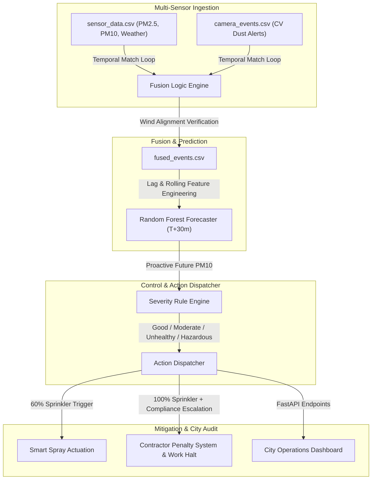

# 🌫️ DustVision: Smart-City Particulate Fusion, ML Forecasting & Governance Framework

> Fusing IoT telemetry, wind vectors, and computer vision events to proactively mitigate urban construction dust.

[](https://opensource.org/licenses/MIT)
[](https://www.python.org/)
[](https://fastapi.tiangolo.com/)
[](https://scikit-learn.org/)

DustVision is an enterprise-grade, smart-city-oriented software architecture engineered to **detect, forecast, and actively mitigate construction-driven dust pollution (PM2.5 and PM10)**. By fusing real-time IoT particulate sensor arrays, wind vectors, and closed-circuit camera dust event classifiers, the system operates a proactive mitigation autopilot that triggers local dust suppression (sprinklers) and logs automated contractor compliance penalties days before air quality breaches regulatory limits.

---

## 🏗️ Technical & Analytical Architecture

DustVision couples multi-sensor data fusion, time-series machine learning, and rule-based governance into a seamless urban orchestration loop:



---

## ⚡ Core Engineering Pillars

### 1. Temporal Window & Wind Corridor Fusion
*   **Time-Window Matching:** Cross-references raw IoT sensor spikes with spatial computer vision (CV) camera events within a narrow $\pm 2$-minute window.
*   **Wind Corridor Validation:** Verifies dust transport physics by determining if local wind vectors fall within the critical $50^\circ \text{ to } 140^\circ$ urban corridor. True dust events (`label = 1`) are flagged only when sensor spikes, camera alarms, and wind alignment are simultaneously confirmed.

### 2. Proactive Machine Learning Forecasting
*   **Temporal Lag Engineering:** Creates autoregressive features (PM10 lag windows of 5, 15, 30, and 60 minutes) coupled with rolling statistics (means, standard deviations) to act as leading indicators of PM spikes.
*   **Unsupervised / Supervised Regressor:** Employs a robust Random Forest Regressor optimized for sub-millisecond execution, predicting localized PM10 levels up to 30 minutes into the future.

### 3. Severity Actuation & Governance Dispatch
*   **Automated Spray Mapping:** Unhealthy forecasts ($150\text{--}250\ \mu\text{g/m}^3$) trigger automated water mist sprinklers at 60% intensity for 180 seconds.
*   **Contractor Compliance Scoring:** Hazardous forecasts ($>250\ \mu\text{g/m}^3$) trigger 100% spray mitigation, dispatch municipal warnings, and flag heavy earthmoving contractor infractions for automated legal/financial penalty tracking.

---

## 🚦 Mitigation Thresholds & Rules

```text
  Predicted Future PM10 Concentration (T + 30 mins)
       │
       ├──► [PM10 < 50]                                  ==► GOOD State (Standby)
       ├──► [50 <= PM10 < 150]                           ==► MODERATE State (Active monitoring)
       ├──► [150 <= PM10 < 250]                          ==► UNHEALTHY State (60% Spray + Warnings)
       └──► [PM10 >= 250]                                ==► HAZARDOUS State (100% Spray + Work Halt)
```

---

## ⚙️ Specifications & Local Constraints

*   **Low Computational Footprint:** Entire prediction pipeline is optimized to run locally on resource-constrained municipal servers (e.g., dual-core MacBook Air 2017 i5, 8GB RAM).
*   **Sub-Millisecond Inference:** Inference latency is **<5ms** per data point, allowing for massive scaling across thousands of smart city quadrants.
*   **Edge Memory Footprint:** FastAPI prediction server operates on **<45MB RAM** with no heavy GPU or neural network framework dependencies.

---

## 🚀 Quick Start (Under 60 Seconds)

### 1. Install System Dependencies
Ensure you have Python 3.8+ installed, then clone the repository and install all library packages:

```bash
git clone https://github.com/seeramsujay/dust-vision.git
cd dust-vision
pip install -r requirements.txt
```

### 2. Run ML Forecasting Pipeline
Train the Random Forest regressor and generate prediction plots and before/after mitigation curves:

```bash
python pm_forecast.py
```
This saves the serialized model (`rf_pm_forecast.pkl`) and outputs:
*   `prediction_plots.png` (actual vs predicted PM10)
*   `impact_simulation.png` (pollution reduction curve)
*   `metrics_table.json` (MAE and RMSE validation metrics)

### 3. Launch FastAPI Prediction Server
Spin up the local API endpoints to serve real-time predictions to your control dashboard:

```bash
python api.py
```
Open your browser to `http://localhost:8000/docs` to interact with:
*   `POST /predict` – Predict PM10 levels based on the latest engineered sensor features.
*   `GET /metrics` – Fetch current MAE and RMSE model performance numbers.
*   `GET /simulate_mitigation` – Simulate the reduction rate under proactive sprinkler dispatch.

---

## 📂 Repository Layout

*   `/data`: Houses clean CSV logs for sensors, camera events, and final fused events.
*   `/ml`: Contains notebooks, plots, metrics, and the serialized Random Forest regressor.
*   `aq_severity_engine.py`: Defines the classification levels (Good to Hazardous).
*   `action_mapping_system.py`: Controls automated sprinkler dispatches and contractor halting flags.
*   `orchestrator.py`: Integrates sensor data streams, forecast models, and mitigation dispatches.

---

## 📄 License

Distributed under the **MIT License**. See `LICENSE` for details.
